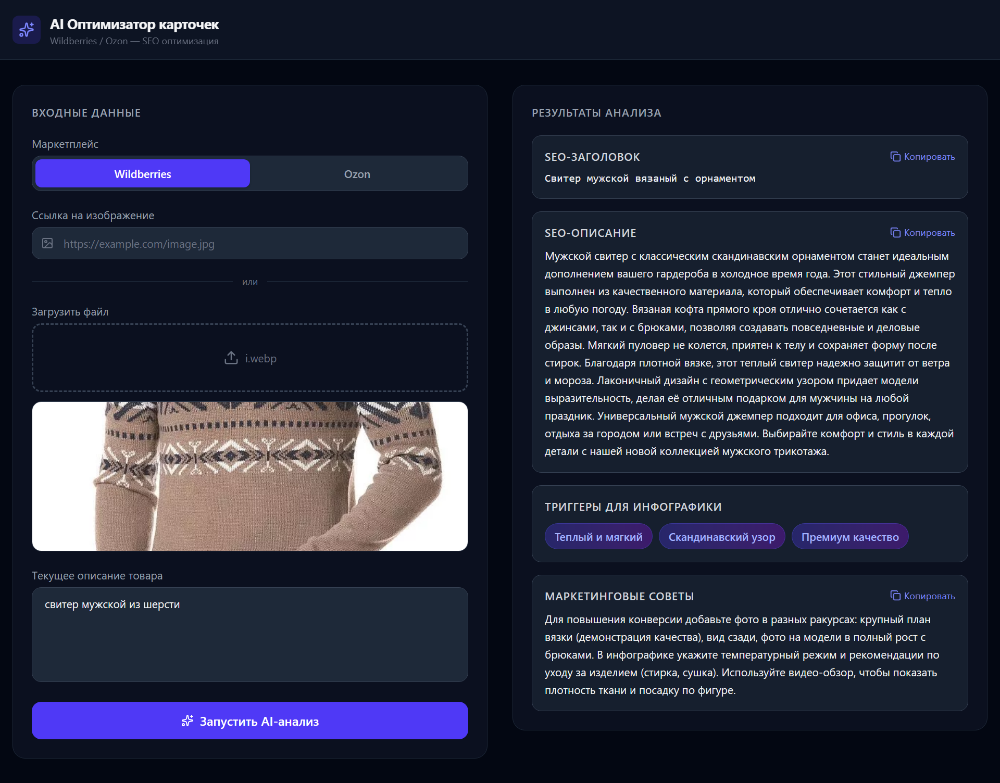

<p align="center">
  
</p>

<p align="center">
  
  
  
  
  
  
  
</p>

---

# AI Marketplace Optimizer

### Мультимодальный AI SaaS для селлеров маркетплейсов. SEO-генерация, анализ изображений, детекция триггеров инфографики. Модульная архитектура с расширяемым слоем интеграции API Wildberries и Ozon.

**AI Marketplace Optimizer** — полнофункциональное fullstack SaaS-приложение для мультимодальной генерации и SEO-оптимизации карточек товаров под Wildberries и Ozon на базе Google Gemini.

> **Бизнес-ценность:** Сокращение времени на подготовку контента в **10+ раз** за счет использования мультимодального ИИ, который «видит» товар на фото и «пишет» продающий текст под алгоритмы конкретной площадки.

---

## Ключевые возможности

### Мультимодальный анализ (Vision + Text)
ИИ не просто генерирует текст — он анализирует визуальный контекст (фотографии товара) для формирования точного описания. Gemini получает сырые байты изображения, что исключает лишние сетевые задержки.

### Marketplace-Adaptive Prompts
Жесткое разделение промптов под требования Wildberries (до 60 симв. заголовок) и Ozon (формулы с использованием ключевых слов).

| Параметр | Wildberries | Ozon |
|----------|-------------|------|
| **Заголовок** | Строгий лимит до 60 символов, без спама, без дублирования | Богатое наименование до 200 символов по формуле Тип + Бренд + Особенности |
| **Описание** | Нативный LSI-копирайтинг до 3000 символов, вплетение поисковых синонимов | Конверсионный b2c-текст с упором на выгоды |
| **Философия** | Плотный художественный текст с ключами | Маркетинговые триггеры для покупателя |

### Детектор триггеров инфографики
Автоматическая рекомендация по добавлению преимуществ на фото товара, основанная на анализе визуальных паттернов. ИИ выделяет сильные стороны: *«100% натуральная шерсть»*, *«Влагозащита IPX4»*, *«Премиальное качество»* — и рекомендует вынести их на обложку.

### Enterprise-Ready Архитектура
- **Асинхронное взаимодействие** — FastAPI async endpoints
- **Модульная архитектура** — готовый слой для интеграции с API Wildberries и Ozon (базовые HTTP-клиенты на httpx, Pydantic-схемы, middleware)
- **SOCKS5-прокси** — стабильный доступ к Gemini API в РФ
- **Pydantic v2-валидация** — строгий контроль схем, предотвращение галлюцинаций
- **Graceful error handling** — обработка rate limiting (429) с понятными сообщениями

### Дополнительно
- Копирование результатов в буфер обмена одной кнопкой
- Адаптивная вёрстка (Desktop / Mobile)
- Skeleton loader на время генерации
- CORS настроен для работы фронтенда с бэкендом

---

## Легкая интеграция с API Wildberries и Ozon

Архитектура спроектирована так, что подключение реальных API маркетплейсов не требует переписывания существующего кода. Достаточно добавить:

```python
# backend/marketplaces/wb.py
class WildberriesAPI:
    async def get_products(self): ...
    async def update_card(self, nm_id, seo_data): ...

# backend/marketplaces/ozon.py  
class OzonAPI:
    async def get_products(self): ...
    async def update_card(self, product_id, seo_data): ...
```

**Что уже есть для интеграции:**
- Асинхронный HTTP-клиент (httpx) в зависимостях
- Pydantic-схемы для валидации запросов/ответов
- Middleware для авторизации (API-ключи, Bearer token)
- CORS настроен для любых origins

**Типовой сценарий интеграции:**
1. Продавец вводит API-ключи маркетплейса в UI
2. Фронтенд запрашивает список товаров продавца через бэкенд
3. Пользователь выбирает товар → AI анализирует → готовый SEO-текст
4. Кнопка «Применить к карточке» отправляет результат напрямую в API маркетплейса

---

## Архитектура системы

```
┌─────────────────────────────────────┐     ┌──────────────────┐
│  FastAPI (serves React SPA + API)  │────>│  Google Gemini   │
│  ┌──────────┐  ┌──────────────────┐│<────│  Vision + Text   │
│  │ Static   │  │  /api/*          ││     └──────────────────┘
│  │ Files    │  │  analyze health  ││
│  │ (SPA)    │  │  marketplace     ││
│  └──────────┘  └────────┬─────────┘│
└─────────────────────────┼───────────┘
                          │
                   ┌──────┴──────┐          ┌──────────────────┐
                   │  Pydantic   │          │  Wildberries API │
                   │  Validation │──────────│  Ozon Seller API │
                   └─────────────┘          │  (extensible)    │
                                           └──────────────────┘
```

```
├── backend/                    # FastAPI + Gemini API
│   ├── main.py                 # Эндпоинты, логика, CORS, SPA serve
│   ├── config.py               # Настройки из .env (API key, proxy)
│   ├── schemas.py              # Pydantic-схемы запросов и ответов
│   ├── requirements.txt        # Зависимости Python
│   ├── Dockerfile              # Multi-stage Python slim образ
│   ├── pyproject.toml          # Ruff + pytest конфиг
│   ├── tests/                  # 22 теста (API, marketplace, retry)
│   │   ├── test_api.py
│   │   ├── test_analyze.py
│   │   └── test_marketplaces.py
│   └── marketplaces/           # API-клиенты WB/Ozon с retry
│       ├── base.py
│       ├── wb.py
│       ├── ozon.py
│       └── schemas.py
│
├── frontend/                   # React + Vite + TypeScript + Tailwind
│   ├── src/
│   │   ├── components/
│   │   │   ├── Dashboard.tsx        # Главный экран
│   │   │   ├── ResultCard.tsx       # Виджет результата с копированием
│   │   │   ├── TriggerTags.tsx      # Теги триггеров инфографики
│   │   │   └── SkeletonLoader.tsx   # Скелетон-лоадер
│   │   ├── api.ts              # Клиент для запросов к бэкенду
│   │   ├── types.ts            # TypeScript-интерфейсы
│   │   └── App.tsx             # Точка входа
│   ├── vite.config.ts          # Vite + Tailwind + Proxy на бэкенд
│   ├── Dockerfile              # Nginx для production сборки
│   └── nginx.conf
│
├── .github/workflows/ci.yml    # CI: lint + test + docker build
├── docker-compose.yml          # Бэкенд + Nginx фронтенд
├── render.yaml                 # Конфигурация деплоя на Render
├── Procfile                    # Start command для Render
├── .env.example
├── .gitattributes
└── README.md
```

---

## Технологический стек

| Уровень | Технологии |
|---------|-----------|
| **Frontend** | React 19, TypeScript, Vite, Tailwind CSS v4, Lucide React |
| **Backend** | Python 3.11+, FastAPI (Async), Pydantic v2, httpx |
| **AI** | Google Gemini (мультимодальное ядро Vision + Text) |
| **Infrastructure** | SOCKS5 Proxy для стабильного доступа к API в РФ |
| **Deploy** | Render (Blueprint-конфигурация, готовый render.yaml) |

---

## Быстрый старт

### Локальная разработка

```bash
# Клонирование
git clone https://github.com/lazmaksim2019-ops/ai-marketplace-optimizer-saas.git
cd ai-marketplace-optimizer-saas

# Бэкенд
cd backend
python -m venv .venv
.venv\Scripts\activate      # Windows
# source .venv/bin/activate  # Linux/Mac
pip install -r requirements.txt
```

Создайте `.env` в папке `backend`:
```env
GEMINI_API_KEY=ваш_ключ_google_ai_studio
# Опционально — SOCKS5-прокси для регионов без прямого доступа:
PROXY_HOST=your_proxy_host
PROXY_PORT=your_proxy_port
PROXY_USER=your_proxy_user
PROXY_PASS=your_proxy_pass
```

```bash
# Запуск бэкенда
uvicorn main:app --reload --port 8000

# Фронтенд (в новом терминале)
cd frontend
npm install
npm run dev
```

Фронтенд доступен на `http://localhost:5173`, прокси на бэкенд настроен автоматически.

### Деплой на Render (один сервис)

Проект содержит готовую конфигурацию `render.yaml` для деплоя через Render Blueprint —
или деплойте вручную как Web Service:

1. Зайдите в [Render Dashboard](https://dashboard.render.com/) → **New + Web Service**
2. Подключите GitHub-репозиторий
3. Настройки:
   - **Name:** `ai-marketplace-optimizer`
   - **Runtime:** `Python`
   - **Build Command:** `cd frontend && npm ci && npm run build && cd ../backend && pip install -r requirements.txt`
   - **Start Command:** `cd backend && uvicorn main:app --host 0.0.0.0 --port $PORT`
4. Добавьте переменную окружения: `GEMINI_API_KEY`

Фронтенд (React + Vite) встроен в бэкенд — бэкенд сам отдаёт статику на `GET /`.
Никаких отдельных сервисов для фронтенда не нужно.

---

## API

### `POST /api/analyze`
Принимает `multipart/form-data`:

| Поле | Тип | Обязательный | Описание |
|------|-----|:---:|---------|
| `description` | string | ✅ | Текущее описание товара |
| `marketplace` | string | ❌ | `"wb"` или `"ozon"` (по умолчанию `"wb"`) |
| `file` | file | ❌ | Изображение товара |
| `image_url` | string | ❌ | Ссылка на изображение |

**Ответ:**
```json
{
  "seo_title": "Свитер мужской из натуральной шерсти",
  "seo_description": "Мужской свитер...",
  "infographics_triggers": ["100% натуральная шерсть", "Премиальное качество"],
  "marketing_tips": "Рекомендуем заменить фон на студийное фото"
}
```

### `GET /api/health`
Проверка работоспособности сервера.

---

## Roadmap

- [x] MVP: генерация SEO-текста + триггеры инфографики
- [x] Дифференциация стратегий Wildberries / Ozon
- [x] Обработка rate limiting (429)
- [x] Готовая архитектура для интеграции с API Wildberries и Ozon
- [ ] Rich-контент (генерация HTML-лендинга для Ozon)
- [ ] Генерация alt-тегов для изображений
- [ ] Подключение реальных API Wildberries и Ozon
- [ ] История запросов (база данных)
- [ ] Анализ конкурентов (парсинг топ-10 карточек)

---

## Лицензия

Proprietary / Closed Source. Все права защищены.

---

## Автор

**Александр Лазаренко** — Fullstack Developer (React + FastAPI + AI)

[](https://t.me/your_nickname)
[](https://github.com/your-username)

---

> *«AI не заменит селлера. Но селлер, использующий AI, заменит того, кто им не пользуется.»*

